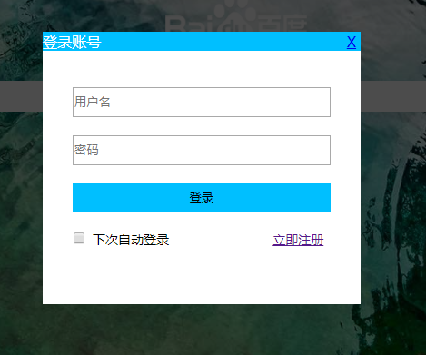
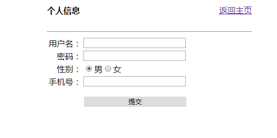
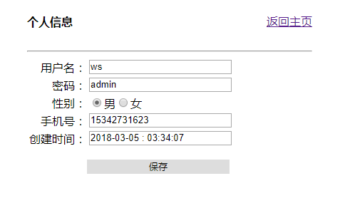

### 基于lucene全文检索引擎实现的短文本匹配系统

#### 运行结果如下图所示
主界面

搜索结果界面

翻页

内容展示

登录模块

注册模块

个人信息展示模块

#### ajax什么时候执行success，什么时候执行error

> 简单的说Ajax请求通过XMLHttpRequest对象发送请求，该对象有四个状态（readyState）：
 0-未初始化、1-正在初始化、2-发送数据、3-正在发送数据、4-完成。
 当XMLHttpRequest.readyState为4时，表示ajax请求已经完成可以得到响应结果。
 ajax的success和error方法根据响应状态码来触发。当XMLHttpRequest.status为200的时候，表示响应成功，此时触发success().其他状态码则触发error()。
 除了根据响应状态码外，ajax还会在下列情况下走error方法：
 返回数据类型不是JSON 网络中断 后台响应中断
 
 * 使用ajax提交表单数据时，一定要把button写在form外面，why?,so confusing!
 
 * jquery获取input type=raido的值
 $('input:radio[name="radioname"]:checked').val();
 
 * springmvc中返回json数据时，如果json中有中文信息，需要设置 @RequestMapping 的 produces 参数 produces = "text/json;charset=UTF-8"

